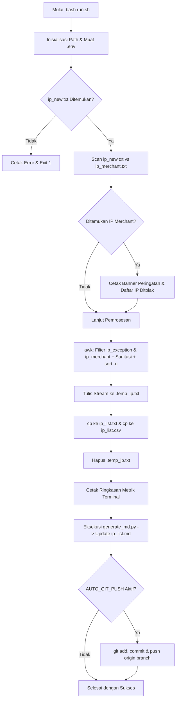

# Blackened - IP Management & Threat Intelligence Utility

Blackened adalah utilitas otomatisasi berbasis shell script (`run.sh`) dan Python (`generate_md.py`) yang dirancang untuk mengelola, menyortir, membersihkan (sanitasi), mendeduplikasi, mengecualikan (*whitelist*), memproteksi IP Merchant resmi, serta memperkaya daftar IP address (blacklist/threat feed) dengan data geolokasi, ISP, ASN, dan reputasi ancaman AbuseIPDB secara otomatis.

Hasil penyortiran basis data IP disimpan secara simultan dalam **dua format file**: `.txt` (`ip_list.txt`) dan `.csv` (`ip_list.csv`), serta dilengkapi fitur proteksi IP Merchant dan opsi **Auto Commit & Push ke GitHub**.

---

## Gambaran Umum & Fungsi `run.sh`

Script `run.sh` berfungsi sebagai *orchestrator* dan *core processing engine* utama. Script ini bertanggung jawab penuh atas integritas data, siklus hidup file input-output, proteksi IP Merchant, pemfilteran aturan pengecualian, pembuatan ganda format file basis data, orkestrasi pembaruan dokumentasi intelijen, dan integrasi version control GitHub.

### Fungsi Utama:
1. **Penggabungan Data Input**: Menggabungkan IP dari basis data aktif (`ip_list.txt` / `ip_list.csv`) dengan IP baru (`ip_new.txt`).
2. **Proteksi IP Merchant & Peringatan Otomatis**: Mendeteksi jika terdapat IP yang terdaftar di `ip_merchant.txt` pada file input `ip_new.txt`. Script menampilkan banner peringatan daftar IP yang ditolak dan mencegah IP tersebut masuk ke database blacklist.
3. **Penerapan Aturan Pengecualian (*Exception/Whitelist*)**: Mengeliminasi seluruh IP yang terdaftar pada `ip_exception.txt` secara deterministik.
4. **Normalisasi & Sanitasi Format**: Membersihkan karakter baris Windows (`\r`), UTF-8 BOM (`\xef\xbb\xbf`), spasi awal/akhir (*trimming*), dan baris kosong.
5. **Pengurutan Numerik per Oktet & Deduplikasi**: Mengurutkan alamat IP berdasarkan urutan numerik empat oktet IPv4 sekaligus memastikan tidak ada duplikasi entri.
6. **Output Ganda Otomatis (*Dual Format Generation*)**: Menyimpan hasil pemrosesan ke dalam dua file basis data secara bersamaan: `ip_list.txt` dan `ip_list.csv`.
7. **Pembaruan Atomik (*Atomic Update*)**: Menjaga keutuhan file basis data dengan mekanisme penulisan berkas temporer sebelum proses pergantian (*file swap*).
8. **Pelaporan Metrik Eksekusi**: Menghitung dan mencetak metrik perubahan data secara transparan pada antarmuka terminal.
9. **Pemicu Otomatis Modul Intelijen**: Mengeksekusi modul pengayaan `generate_md.py` untuk menyinkronkan laporan `ip_list.md`.
10. **Auto Commit & Push GitHub (Opsional)**: Mendukung pengunggahan otomatis berkas `ip_list.txt`, `ip_list.csv`, dan `ip_list.md` ke GitHub saat diaktifkan via `.env` (`AUTO_GIT_PUSH=true`).

---

## Rincian Teknis & Arsitektur `run.sh`

### 1. Struktur File Proyek

```text
blackened/
|-- ip_list.txt        # Database utama daftar IP unik dan terurut (Format TXT)
|-- ip_list.csv        # Database utama daftar IP unik dan terurut (Format CSV)
|-- ip_list.md         # Laporan intelijen IP (tabel & statistik)
|-- ip_new.txt         # File input untuk memasukkan daftar IP baru
|-- ip_exception.txt   # File whitelist/pengecualian IP manual
|-- ip_merchant.txt    # File whitelist resmi IP Merchant yang terproteksi
|-- run.sh             # Entrypoint bash script utama
|-- generate_md.py     # Engine pengayaan metadata & AbuseIPDB
|-- .env.example       # Template konfigurasi API Key & Auto Push
|-- .env               # File environment lokal (opsional)
|-- .ip_cache.json     # Cache lokal respons API (otomatis dibuat)
|-- LICENSE            # Lisensi proyek
`-- README.md          # Dokumentasi teknis
```

---

### 2. Bedah Teknis Baris Kode `run.sh`

#### A. Inisialisasi Jalur & Pemuatan Konfigurasi `.env`
```bash
DIR="$(cd "$(dirname "${BASH_SOURCE[0]}")" && pwd)"
LIST_IP_TXT="$DIR/ip_list.txt"
LIST_IP_CSV="$DIR/ip_list.csv"
NEW_IP="$DIR/ip_new.txt"
EXCEPTION_IP="$DIR/ip_exception.txt"
MERCHANT_IP="$DIR/ip_merchant.txt"
TEMP_FILE="$DIR/.temp_ip.txt"
GENERATE_MD_SCRIPT="$DIR/generate_md.py"
ENV_FILE="$DIR/.env"
```
- Menentukan absolute path direktori kerja untuk menjamin eksekusi portabel dari direktori mana saja.

#### B. Deteksi & Peringatan Konflik IP Merchant
```bash
MERCHANT_CONFLICTS=$(awk '
    NR==FNR {
        gsub(/\r/, ""); gsub(/^\xef\xbb\xbf/, ""); gsub(/^[[:space:]]+|[[:space:]]+$/, "")
        if ($0 != "") merchant[$0] = 1
        next
    }
    {
        gsub(/\r/, ""); gsub(/^\xef\xbb\xbf/, ""); gsub(/^[[:space:]]+|[[:space:]]+$/, "")
        if ($0 != "" && ($0 in merchant)) {
            print $0
        }
    }
' "$MERCHANT_IP" "$NEW_IP" 2>/dev/null | sort -u)

if [ -n "$MERCHANT_CONFLICTS" ]; then
    CONFLICT_COUNT=$(echo "$MERCHANT_CONFLICTS" | grep -v '^[[:space:]]*$' | wc -l | tr -d ' ')
    echo "=========================================="
    echo "    PERINGATAN: IP MERCHANT TERDETEKSI!   "
    echo "=========================================="
    echo "Ditemukan $CONFLICT_COUNT IP pada $NEW_IP yang terdaftar sebagai IP Merchant:"
    echo "$MERCHANT_CONFLICTS" | while read -r ip; do
        if [ -n "$ip" ]; then
            echo "  - [DITOLAK] $ip"
        fi
    done
    echo "Seluruh IP di atas OTOMATIS DITOLAK dan TIDAK dimasukkan ke database."
    echo "------------------------------------------"
fi
```
- Memeriksa apakah ada IP di `ip_new.txt` yang cocok dengan `ip_merchant.txt`. Jika ditemukan, sistem mencetak banner peringatan dan menandai IP tersebut sebagai ditolak.

#### C. Pipeline Pemrosesan Data & Filter Ganda
```bash
awk '
    # Tahap 1: Baca file ip_exception.txt
    FILENAME == ARGV[1] {
        gsub(/\r/, ""); gsub(/^\xef\xbb\xbf/, ""); gsub(/^[[:space:]]+|[[:space:]]+$/, "")
        if ($0 != "") exc[$0] = 1
        next
    }
    # Tahap 2: Baca file ip_merchant.txt
    FILENAME == ARGV[2] {
        gsub(/\r/, ""); gsub(/^\xef\xbb\xbf/, ""); gsub(/^[[:space:]]+|[[:space:]]+$/, "")
        if ($0 != "") merchant[$0] = 1
        next
    }
    # Tahap 3: Baca gabungan ip_list.txt & ip_new.txt
    {
        gsub(/\r/, ""); gsub(/^\xef\xbb\xbf/, ""); gsub(/^[[:space:]]+|[[:space:]]+$/, "")
        if ($0 != "" && !($0 in exc) && !($0 in merchant)) {
            print $0
        }
    }
' "$EXCEPTION_IP" "$MERCHANT_IP" <(cat "$LIST_IP_TXT" "$NEW_IP" 2>/dev/null) \
    | sort -n -t . -k 1,1 -k 2,2 -k 3,3 -k 4,4 -u > "$TEMP_FILE"
```
- Memastikan tidak ada IP dari `ip_exception.txt` maupun `ip_merchant.txt` yang lolos ke dalam database blacklist.

#### D. Sinkronisasi Output Ganda (TXT & CSV) & Pembaruan Laporan
```bash
cp "$TEMP_FILE" "$LIST_IP_TXT"
cp "$TEMP_FILE" "$LIST_IP_CSV"
rm -f "$TEMP_FILE"

COUNT_AFTER=$(grep -v '^[[:space:]]*$' "$LIST_IP_TXT" 2>/dev/null | wc -l | tr -d ' ')
DIFF=$((COUNT_AFTER - COUNT_BEFORE))

if [ -f "$GENERATE_MD_SCRIPT" ]; then
    echo "Memperbarui ip_list.md..."
    python3 "$GENERATE_MD_SCRIPT"
fi
```

---

### 3. Diagram Alur Pemrosesan Data



---

## Panduan Penggunaan

### 1. Konfigurasi File `.env` (Opsional)
Salin berkas template `.env.example`:
```bash
cp .env.example .env
```

Sesuaikan konfigurasi:
```env
# API Key AbuseIPDB untuk skor ancaman
ABUSEIPDB_API_KEY=masukkan_api_key_disini

# Aktifkan auto commit & push ke GitHub (true / false)
AUTO_GIT_PUSH=true
```

### 2. Manajemen Data IP
- **Menambah IP Baru**: Masukkan daftar IP ke dalam file `ip_new.txt` (satu IP per baris).
- **Mengecualikan IP Manual (*Whitelist*)**: Masukkan IP yang ingin dihapus atau dikecualikan ke dalam `ip_exception.txt`.
- **Daftar Proteksi IP Merchant**: Daftarkan IP merchant resmi ke dalam `ip_merchant.txt` agar dicegah masuk ke database blacklist secara otomatis.

### 3. Eksekusi Script
Pastikan izin eksekusi aktif:
```bash
chmod +x run.sh
```

Jalankan script:
```bash
./run.sh
```
atau
```bash
bash run.sh
```

### 4. Contoh Output Eksekusi Terminal (Dengan Deteksi IP Merchant)
```text
==========================================
    PERINGATAN: IP MERCHANT TERDETEKSI!   
==========================================
Ditemukan 1 IP pada /path/to/blackened/ip_new.txt yang terdaftar sebagai IP Merchant:
  - [DITOLAK] 85.187.128.33
Seluruh IP di atas OTOMATIS DITOLAK dan TIDAK dimasukkan ke database.
------------------------------------------
==========================================
         PROSES PENYORTIRAN IP            
==========================================
Jumlah IP sebelumnya            : 58
Jumlah aturan pengecualian      : 2
Jumlah IP Merchant terproteksi  : 1309
Perubahan IP bersih             : 0
Total IP unik sekarang          : 58
Format database tersimpan       : ip_list.txt & ip_list.csv
------------------------------------------
Memperbarui ip_list.md...
Berhasil memperbarui /path/to/blackened/ip_list.md (Total: 58 IP)
==========================================
Proses selesai dengan sukses!
```
