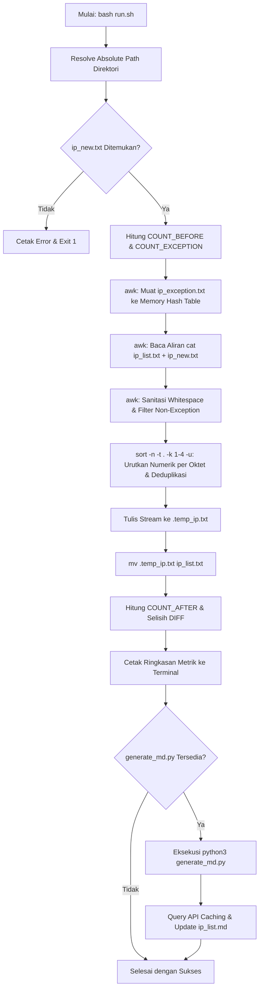

# Blackened - IP Management & Threat Intelligence Utility

Blackened adalah utilitas otomatisasi berbasis shell script (`run.sh`) dan Python (`generate_md.py`) yang dirancang untuk mengelola, menyortir, membersihkan (sanitasi), mendeduplikasi, mengecualikan (*whitelist*), serta memperkaya daftar IP address (blacklist/threat feed) dengan data geolokasi, ISP, ASN, dan reputasi ancaman AbuseIPDB secara otomatis.

---

## Gambaran Umum & Fungsi `run.sh`

Script `run.sh` berfungsi sebagai *entrypoint* dan *core processing engine* utama. Script ini bertanggung jawab penuh atas integritas data, siklus hidup file input-output, pemfilteran aturan pengecualian, dan orkestrasi pembaruan dokumentasi intelijen.

### Fungsi Utama:
1. **Penggabungan Data Input**: Menggabungkan IP dari basis data aktif (`ip_list.txt`) dengan IP baru (`ip_new.txt`).
2. **Penerapan Aturan Pengecualian (*Exception/Whitelist*)**: Mengeliminasi seluruh IP yang terdaftar pada `ip_exception.txt` secara deterministik.
3. **Normalisasi & Sanitasi Format**: Membersihkan karakter baris Windows (`\r`), spasi awal/akhir (*trimming*), dan baris kosong.
4. **Pengurutan Numerik per Oktet & Deduplikasi**: Mengurutkan alamat IP berdasarkan urutan numerik empat oktet IPv4 sekaligus memastikan tidak ada duplikasi entri.
5. **Pembaruan Atomik (*Atomic Update*)**: Menjaga keutuhan file basis data dengan mekanisme penulisan berkas temporer sebelum proses pergantian (*file swap*).
6. **Pelaporan Metrik Eksekusi**: Menghitung dan mencetak metrik perubahan data secara transparan pada antarmuka terminal.
7. **Pemicu Otomatis Modul Intelijen**: Mengeksekusi modul pengayaan `generate_md.py` untuk menyinkronkan laporan `ip_list.md`.

---

## Rincian Teknis & Arsitektur `run.sh`

### 1. Struktur File Proyek

```text
blackened/
|-- ip_list.txt        # Database utama daftar IP unik dan terurut
|-- ip_list.md         # Laporan intelijen IP (tabel & statistik)
|-- ip_new.txt         # File input untuk memasukkan daftar IP baru
|-- ip_exception.txt   # File whitelist/pengecualian IP yang diabaikan
|-- run.sh             # Entrypoint bash script utama
|-- generate_md.py     # Engine pengayaan metadata & AbuseIPDB
|-- .env.example       # Template konfigurasi API Key
|-- .env               # File environment API Key (opsional)
|-- .ip_cache.json     # Cache lokal respons API (otomatis dibuat)
|-- LICENSE            # Lisensi proyek
`-- README.md          # Dokumentasi teknis
```

---

### 2. Bedah Teknis Baris Kode `run.sh`

#### A. Resolusi Lokasi Dinamis (*Dynamic Path Resolution*)
```bash
DIR="$(cd "$(dirname "${BASH_SOURCE[0]}")" && pwd)"
LIST_IP="$DIR/ip_list.txt"
NEW_IP="$DIR/ip_new.txt"
EXCEPTION_IP="$DIR/ip_exception.txt"
TEMP_FILE="$DIR/.temp_ip.txt"
GENERATE_MD_SCRIPT="$DIR/generate_md.py"
```
- Menentukan absolute path lokasi script `run.sh` berada, sehingga perintah dapat dieksekusi dari direktori mana saja tanpa kegagalan referensi path relatif.

#### B. Validasi & Inisialisasi Berkas
```bash
if [ ! -f "$LIST_IP" ]; then
    touch "$LIST_IP"
fi

if [ ! -f "$EXCEPTION_IP" ]; then
    touch "$EXCEPTION_IP"
fi

if [ ! -f "$NEW_IP" ]; then
    echo "Error: File $NEW_IP tidak ditemukan!"
    exit 1
fi
```
- Memastikan `ip_list.txt` dan `ip_exception.txt` selalu tersedia melalui `touch`.
- Memverifikasi keberadaan `ip_new.txt`. Jika tidak ditemukan, eksekusi dihentikan dengan *exit status* 1.

#### C. Pengambilan Metrik Baseline
```bash
COUNT_BEFORE=$(grep -v '^[[:space:]]*$' "$LIST_IP" 2>/dev/null | wc -l | tr -d ' ')
COUNT_EXCEPTION=$(grep -v '^[[:space:]]*$' "$EXCEPTION_IP" 2>/dev/null | wc -l | tr -d ' ')
```
- Menghitung total entri IP valid sebelum operasi dijalankan dengan mengabaikan baris kosong dan whitespace.

#### D. Pipeline Pemrosesan Data Terpadu
```bash
awk '
    # Tahap 1: Muat seluruh IP pengecualian ke dalam hash table memori
    NR==FNR {
        gsub(/\r/, "")
        gsub(/^[[:space:]]+|[[:space:]]+$/, "")
        if ($0 != "") exc[$0] = 1
        next
    }
    # Tahap 2: Baca stream gabungan ip_list.txt dan ip_new.txt
    {
        gsub(/\r/, "")
        gsub(/^[[:space:]]+|[[:space:]]+$/, "")
        if ($0 != "" && !($0 in exc)) {
            print $0
        }
    }
' "$EXCEPTION_IP" <(cat "$LIST_IP" "$NEW_IP" 2>/dev/null) \
    | sort -n -t . -k 1,1 -k 2,2 -k 3,3 -k 4,4 -u > "$TEMP_FILE"
```

Tahapan pipeline:
1. **Pengecualian Berbasis Hash Table (`awk`)**:
   - `NR==FNR`: Membaca `ip_exception.txt`, melakukan pembersihan karakter `\r` dan spasi, lalu menyimpannya dalam array asosiatif `exc`.
   - Blok kedua: Membaca aliran gabungan `ip_list.txt` dan `ip_new.txt`. Baris hanya dicetak jika tidak kosong dan tidak terdapat dalam `exc` (`!($0 in exc)`).
2. **Pengurutan Numerik & Deduplikasi (`sort`)**:
   - `-n`: Mengaktifkan pengurutan numerik.
   - `-t .`: Menjadikan tanda titik (`.`) sebagai pemisah kolom/oktet.
   - `-k 1,1 -k 2,2 -k 3,3 -k 4,4`: Membandingkan secara berurutan oktet pertama, kedua, ketiga, hingga keempat.
   - `-u`: Menghapus entri duplikat (*unique filter*).
3. **Penyimpanan Berkas Sementara**:
   - Output dialihkan ke `.temp_ip.txt`.

#### E. Pembaruan Atomik & Perhitungan Diferensial
```bash
mv "$TEMP_FILE" "$LIST_IP"
COUNT_AFTER=$(grep -v '^[[:space:]]*$' "$LIST_IP" 2>/dev/null | wc -l | tr -d ' ')
DIFF=$((COUNT_AFTER - COUNT_BEFORE))
```
- Operasi `mv` memastikan pergantian berkas berlangsung secara atomik di level filesystem.
- Menghitung `DIFF` (selisih perubahan jumlah IP bersih).

#### F. Pemicu Generator Laporan
```bash
if [ -f "$GENERATE_MD_SCRIPT" ]; then
    echo "Memperbarui ip_list.md..."
    python3 "$GENERATE_MD_SCRIPT"
fi
```
- Mengeksekusi `generate_md.py` untuk mengumpulkan intelijen data (geolokasi, ISP, ASN, dan AbuseIPDB) serta memperbarui `ip_list.md`.

---

### 3. Diagram Alur Pemrosesan Data



---

## Panduan Penggunaan

### 1. Konfigurasi API AbuseIPDB (Opsional)
Jika ingin mengaktifkan data reputasi ancaman siber pada `ip_list.md`:
1. Salin berkas template:
   ```bash
   cp .env.example .env
   ```
2. Buka `.env` dan masukkan API Key:
   ```env
   ABUSEIPDB_API_KEY=masukkan_api_key_disini
   ```

### 2. Manajemen Data IP
- **Menambah IP Baru**: Masukkan daftar IP ke dalam file `ip_new.txt` (satu IP per baris).
- **Mengecualikan IP (*Whitelist*)**: Masukkan IP yang ingin dihapus atau dikecualikan ke dalam `ip_exception.txt`.

### 3. Eksekusi Script
Pastikan izin eksekusi aktif:
```bash
chmod +x run.sh
```

Jalankan script:
```bash
./run.sh
```
atau
```bash
bash run.sh
```

### 4. Contoh Output Eksekusi Terminal
```text
==========================================
         PROSES PENYORTIRAN IP            
==========================================
Jumlah IP sebelumnya            : 58
Jumlah aturan pengecualian      : 1
Perubahan IP bersih             : 0
Total IP unik sekarang          : 58
------------------------------------------
Memperbarui ip_list.md...
Berhasil memperbarui /Users/hard13/labs/blackened/ip_list.md (Total: 58 IP)
==========================================
Proses selesai dengan sukses!
```
