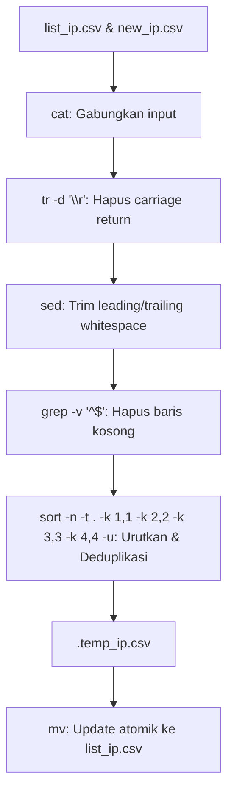

# Blackened - IP Management & Deduplication Utility

Utilitas bash script untuk melakukan penggabungan, sanitasi, deduplikasi, dan pengurutan (*sorting*) daftar IP address secara otomatis dari file input ke dalam file database daftar IP blacklist/whitelist.

---

## 📌 Fitur Utama

- **Deduplikasi Otomatis (Unique Extraction)**: Memastikan tidak ada entri IP yang terduplikasi di dalam daftar akhir.
- **Pengurutan Numerik per Oktet (*Octet-based Sorting*)**: Mengurutkan IPv4 secara presisi berdasarkan nilai numerik setiap oktet (misal: `10.0.0.2` mendahului `10.0.0.10`).
- **Sanitasi Data**:
  - Menghapus karakter Windows Carriage Return (`\r`).
  - Menghapus *leading/trailing whitespaces* (spasi di awal/akhir baris).
  - Menyaring dan menghapus baris kosong secara otomatis.
- **Dukungan Format IP**: Mendukung format IPv4 maupun IPv6.
- **Atomic Update**: Menggunakan file temporer sebelum memperbarui file target untuk menjaga integritas data jika proses terputus.
- **Dynamic Path Resolution**: Script dapat dieksekusi dari direktori mana saja tanpa terikat pada *working directory* saat ini.
- **Statistik Eksekusi**: Menampilkan informasi metrik jumlah IP sebelum proses, jumlah IP baru yang berhasil ditambahkan, dan total IP unik saat ini.

---

## ⚙️ Rincian Teknis

### 1. Struktur File
```text
blackened/
├── list_ip.csv    # File utama penyimpan daftar IP unik dan terurut
├── new_ip.csv     # File input untuk memasukkan daftar IP baru
├── run.sh         # Bash script pemrosesan data
├── LICENSE        # Lisensi proyek
└── README.md      # Dokumentasi teknis dan panduan penggunaan
```

### 2. Alur Pemrosesan Data (*Data Pipeline*)

Pipeline pemrosesan pada `run.sh`:



### 3. Penjelasan Perintah Sort
```bash
sort -n -t . -k 1,1 -k 2,2 -k 3,3 -k 4,4 -u
```
- `-n`: Mengurutkan berdasarkan nilai numerik (*numerical sort*).
- `-t .`: Menetapkan tanda titik (`.`) sebagai pembatas antar *field* / oktet.
- `-k 1,1 -k 2,2 -k 3,3 -k 4,4`: Membandingkan oktet ke-1, ke-2, ke-3, dan ke-4 secara berurutan.
- `-u`: Mengeliminasi baris yang duplikat (*unique*).

---

## 🚀 Cara Penggunaan

### 1. Masukkan IP Baru
Tambahkan daftar IP yang ingin dimasukkan ke dalam file `new_ip.csv` (setiap IP dipisahkan dengan *newline*):
```text
103.14.111.239
4.224.122.112
20.219.160.77
```

### 2. Berikan Izin Eksekusi (Opsional jika belum)
```bash
chmod +x run.sh
```

### 3. Jalankan Script
```bash
./run.sh
```
atau
```bash
bash run.sh
```

### 4. Contoh Output Eksekusi
```text
Proses selesai!
Jumlah IP sebelumnya: 41
Jumlah IP baru yang ditambahkan: 16
Total IP unik sekarang: 57
```
