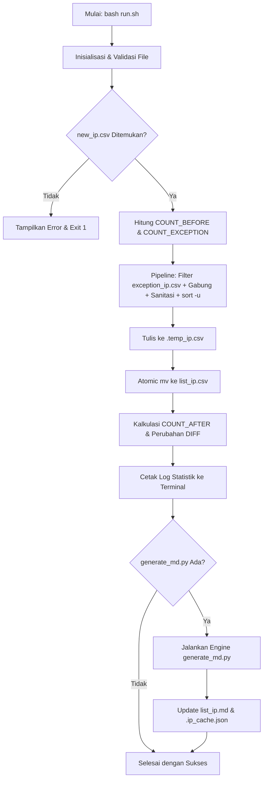

# Blackened - IP Management & Threat Intelligence Utility

Blackened adalah utilitas otomatisasi berbasis Bash dan Python yang dirancang untuk mengelola, menyortir, membersihkan (sanitasi), mendeduplikasi, mengecualikan (*whitelist*), serta memperkaya daftar IP address (blacklist/threat feed) dengan data geolokasi, ISP, ASN, dan reputasi ancaman AbuseIPDB secara otomatis.

---

## Fitur Utama `run.sh`

Script `run.sh` bertindak sebagai *orchestrator* dan *data processing pipeline* utama dengan fitur-fitur berikut:

1. **Resolusi Jalur Dinamis (*Dynamic Path Resolution*)**:
   - Menentukan lokasi direktori kerja berdasarkan lokasi fisik file `run.sh` (`DIR="$(cd "$(dirname "${BASH_SOURCE[0]}")" && pwd)"`). Script dapat dipanggil dan dieksekusi dari direktori mana pun tanpa terpengaruh oleh *working directory* terminal.

2. **Auto-Inisialisasi dan Validasi File**:
   - Memeriksa keberadaan file basis data `list_ip.csv` dan file aturan pengecualian `exception_ip.csv`. Jika file belum ada, script akan otomatis membuatnya (`touch`).
   - Memvalidasi keberadaan file input `new_ip.csv` dan menampilkan pesan kesalahan jika file tidak ditemukan.

3. **Penyaringan Pengecualian IP (*Whitelist / Exception Filtering*)**:
   - Menggunakan pemrosesan berbasis *in-memory hash table* (`awk`) untuk mencocokkan dan mengecualikan IP yang terdaftar di `exception_ip.csv`. IP yang masuk dalam daftar pengecualian otomatis dihapus dari database `list_ip.csv` maupun input `new_ip.csv`.

4. **Pipeline Sanitasi Data Multi-Tahap**:
   - **Pembersihan Line Ending Windows**: Menghapus karakter *Carriage Return* (`\r`).
   - **Trim Spasi**: Menghilangkan spasi dan tab di awal maupun akhir baris (*leading and trailing whitespace*).
   - **Penyaringan Baris Kosong**: Membuang baris kosong secara otomatis.

5. **Pengurutan Numerik per Oktet (*Octet-based Sorting*) dan Deduplikasi**:
   - Mengurutkan IPv4 secara presisi berdasarkan nilai numerik setiap oktet (`10.0.0.2` mendahului `10.0.0.10`).
   - Memastikan tidak ada entri IP duplikat (*single-pass unique extraction*).

6. **Pembaruan Atomik (*Atomic File Update*)**:
   - Seluruh hasil pemrosesan dialirkan terlebih dahulu ke file temporer (`.temp_ip.csv`), lalu ditimpa ke `list_ip.csv` menggunakan operasi `mv` atomik untuk mencegah *data corruption* jika proses terputus tiba-tiba.

7. **Kalkulasi Metrik & Pelaporan Terminal**:
   - Menghitung jumlah IP sebelum proses (`COUNT_BEFORE`), jumlah aturan pengecualian aktif (`COUNT_EXCEPTION`), perubahan bersih IP (`DIFF`), dan total akumulasi IP unik saat ini (`COUNT_AFTER`).

8. **Integrasi Otomatis Modul Intelijen IP (`generate_md.py`)**:
   - Secara otomatis mengeksekusi engine Python setelah `list_ip.csv` selesai diperbarui untuk memutakhirkan tabel laporan dan statistik pada `list_ip.md`.

---

## Rincian Teknis `run.sh`

### 1. Struktur File Proyek

```text
blackened/
|-- list_ip.csv        # Database utama daftar IP unik dan terurut
|-- list_ip.md         # Laporan intelijen IP (tabel & statistik)
|-- new_ip.csv         # File input untuk memasukkan daftar IP baru
|-- exception_ip.csv   # File whitelist/pengecualian IP yang diabaikan
|-- run.sh             # Entrypoint bash script utama
|-- generate_md.py     # Engine pengayaan metadata & AbuseIPDB
|-- .env.example       # Template konfigurasi API Key
|-- .env               # File environment API Key (opsional)
|-- .ip_cache.json     # Cache lokal respons API (otomatis dibuat)
|-- LICENSE            # Lisensi proyek
`-- README.md          # Dokumentasi teknis
```

### 2. Bedah Logika Script `run.sh`

Berikut adalah rincian tahapan kode di dalam `run.sh`:

#### A. Inisialisasi Jalur & Variabel
```bash
DIR="$(cd "$(dirname "${BASH_SOURCE[0]}")" && pwd)"
LIST_IP="$DIR/list_ip.csv"
NEW_IP="$DIR/new_ip.csv"
EXCEPTION_IP="$DIR/exception_ip.csv"
TEMP_FILE="$DIR/.temp_ip.csv"
GENERATE_MD_SCRIPT="$DIR/generate_md.py"
```

#### B. Penghitungan Baseline Baris
Menghitung jumlah baris non-kosong tanpa *whitespace* di `list_ip.csv` dan `exception_ip.csv`:
```bash
COUNT_BEFORE=$(grep -v '^[[:space:]]*$' "$LIST_IP" 2>/dev/null | wc -l | tr -d ' ')
COUNT_EXCEPTION=$(grep -v '^[[:space:]]*$' "$EXCEPTION_IP" 2>/dev/null | wc -l | tr -d ' ')
```

#### C. Pipeline Pemrosesan, Filter Exception, Sanitasi, dan Sort
```bash
awk '
    # Tahap 1: Muat seluruh IP pengecualian ke dalam hash table memori
    NR==FNR {
        gsub(/\r/, "")
        gsub(/^[[:space:]]+|[[:space:]]+$/, "")
        if ($0 != "") exc[$0] = 1
        next
    }
    # Tahap 2: Baca stream gabungan list_ip.csv dan new_ip.csv
    {
        gsub(/\r/, "")
        gsub(/^[[:space:]]+|[[:space:]]+$/, "")
        if ($0 != "" && !($0 in exc)) {
            print $0
        }
    }
' "$EXCEPTION_IP" <(cat "$LIST_IP" "$NEW_IP" 2>/dev/null) \
    | sort -n -t . -k 1,1 -k 2,2 -k 3,3 -k 4,4 -u > "$TEMP_FILE"
```

Penjelasan opsi `sort`:
- `-n`: Mengurutkan nilai berdasarkan numerik (bukan abjad leksikografis).
- `-t .`: Menjadikan tanda titik (`.`) sebagai delimiter antar kolom oktet IP.
- `-k 1,1 -k 2,2 -k 3,3 -k 4,4`: Membandingkan oktet ke-1, ke-2, ke-3, hingga ke-4 secara berurutan.
- `-u`: Memastikan hanya baris unik yang disimpan (*unique filter*).

#### D. Penggantian File Atomik & Update Laporan
```bash
mv "$TEMP_FILE" "$LIST_IP"
COUNT_AFTER=$(grep -v '^[[:space:]]*$' "$LIST_IP" 2>/dev/null | wc -l | tr -d ' ')
DIFF=$((COUNT_AFTER - COUNT_BEFORE))

if [ -f "$GENERATE_MD_SCRIPT" ]; then
    echo "Memperbarui list_ip.md..."
    python3 "$GENERATE_MD_SCRIPT"
fi
```

### 3. Diagram Alur Kerja



---

## Cara Penggunaan

### 1. Konfigurasi API AbuseIPDB (Opsional)
Jika ingin menampilkan skor bahaya AbuseIPDB pada `list_ip.md`:
1. Salin `.env.example` menjadi `.env`:
   ```bash
   cp .env.example .env
   ```
2. Isi `ABUSEIPDB_API_KEY` di dalam file `.env`:
   ```env
   ABUSEIPDB_API_KEY=api_key_anda_disini
   ```

### 2. Menambah IP Baru atau Pengecualian
- **Menambah IP**: Tambahkan daftar IP baru ke dalam `new_ip.csv` (satu IP per baris).
- **Mengecualikan IP (*Whitelist*)**: Tambahkan IP yang ingin dihapus/dikecualikan ke dalam `exception_ip.csv`.

### 3. Menjalankan Script
Pastikan script memiliki izin eksekusi:
```bash
chmod +x run.sh
```

Eksekusi script:
```bash
./run.sh
```
atau
```bash
bash run.sh
```

### 4. Contoh Output Eksekusi Terminal
```text
==========================================
         PROSES PENYORTIRAN IP            
==========================================
Jumlah IP sebelumnya            : 59
Jumlah aturan pengecualian      : 1
Perubahan IP bersih             : -1
Total IP unik sekarang          : 58
------------------------------------------
Memperbarui list_ip.md...
Berhasil memperbarui /Users/hard13/labs/blackened/list_ip.md (Total: 58 IP)
==========================================
Proses selesai dengan sukses!
```
