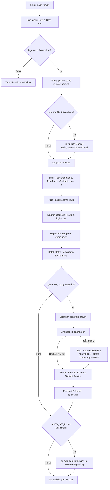

# Blackened - IP Management & Threat Intelligence Utility

Blackened adalah utilitas otomatisasi berbasis *shell script* (`run.sh`) dan modul Python (`generate_md.py`) yang dirancang untuk mengelola, menyortir, membersihkan (sanitasi), mendeduplikasi, mengecualikan (*whitelist*), memproteksi IP Merchant resmi, serta memperkaya daftar IP address (*threat intelligence feed*) dengan data geolokasi, ISP, ASN, reputasi ancaman AbuseIPDB, dan riwayat waktu penambahan (*timestamp* GMT+7) secara otomatis.

Hasil penyortiran basis data IP disimpan secara simultan dalam **dua format file**: `.txt` (`ip_list.txt`) dan `.csv` (`ip_list.csv`), serta menghasilkan dokumen laporan intelijen komprehensif (`ip_list.md`).

---

## Daftar Isi
- [1. Fitur Utama](#1-fitur-utama)
  - [A. Modul Orkestrasi & Pemrosesan (run.sh)](#a-modul-orkestrasi--pemrosesan-runsh)
  - [B. Modul Pengayaan Intelijen (generate_md.py)](#b-modul-pengayaan-intelijen-generate_mdpy)
- [2. Spesifikasi Kebutuhan Sistem](#2-spesifikasi-kebutuhan-sistem)
- [3. Struktur Direktori Proyek](#3-struktur-direktori-proyek)
- [4. Rincian Teknis & Arsitektur](#4-rincian-teknis--arsitektur)
  - [A. Bedah Logika & Pipeline run.sh](#a-bedah-logika--pipeline-runsh)
  - [B. Bedah Engine generate_md.py](#b-bedah-engine-generate_mdpy)
  - [C. Struktur Penyimpanan Cache (.ip_cache.json)](#c-struktur-penyimpanan-cache-ip_cachejson)
  - [D. Diagram Alur Kerja Sistem](#d-diagram-alur-kerja-sistem)
- [5. Panduan Penggunaan & Konfigurasi](#5-panduan-penggunaan--konfigurasi)
  - [A. Konfigurasi Environment (.env)](#a-konfigurasi-environment-env)
  - [B. Manajemen Berkas Masukan (Input Files)](#b-manajemen-berkas-masukan-input-files)
  - [C. Menjalankan Skrip](#c-menjalankan-skrip)
  - [D. Contoh Output Eksekusi Terminal](#d-contoh-output-eksekusi-terminal)
- [6. Praktik Terbaik & Pemeliharaan](#6-praktik-terbaik--pemeliharaan)

---

## 1. Fitur Utama

### A. Modul Orkestrasi & Pemrosesan (`run.sh`)
- **Resolusi Jalur Dinamis (*Dynamic Path Resolution*)**: Mengidentifikasi direktori kerja secara independen dari lokasi pemanggilan terminal (`pwd`), memungkinkan skrip dijalankan dari direktori mana pun atau via cron job.
- **Proteksi IP Merchant & Peringatan Otomatis**: Memindai file input `ip_new.txt` terhadap daftar `ip_merchant.txt`. Jika terdeteksi adanya IP merchant resmi, sistem menampilkan banner peringatan di terminal, menandai IP sebagai ditolak (`[DITOLAK]`), dan secara otomatis mengecualikannya dari database.
- **Penyaringan Pengecualian (*Whitelist / Exception Filtering*)**: Mengecualikan IP yang terdaftar di `ip_exception.txt` menggunakan *in-memory hash table* berbasis `awk` berkinerja tinggi.
- **Sanitasi Data Multi-Tahap**: Menghapus karakter Line Ending Windows (`\r`), UTF-8 BOM (`\xef\xbb\xbf`), spasi awal/akhir (*trimming*), dan baris kosong.
- **Pengurutan Numerik per Oktet & Deduplikasi**: Mengurutkan alamat IPv4 berdasarkan nilai numerik 4 oktet secara hierarkis (`sort -n -t . -k 1,1 -k 2,2 -k 3,3 -k 4,4`) dan menghapus duplikasi entri dalam satu lintasan (*single-pass*).
- **Sinkronisasi Format Ganda (*Dual Database Output*)**: Menyimpan hasil pemrosesan bersih ke `ip_list.txt` dan `ip_list.csv` secara bersamaan dan konsisten.
- **Pembaruan Atomik (*Atomic Update*)**: Menulis berkas temporer (`.temp_ip.txt`) sebelum proses pergantian (*file swap*) untuk mencegah korupsi data saat eksekusi terputus.
- **Auto Commit & Push GitHub (Non-Blocking)**: Mendukung pengunggahan otomatis berkas `ip_list.txt`, `ip_list.csv`, dan `ip_list.md` ke repositori remote (`AUTO_GIT_PUSH=true`) dengan proteksi *non-blocking* (`GIT_TERMINAL_PROMPT=0`).

### B. Modul Pengayaan Intelijen (`generate_md.py`)
- **Pengayaan Geografis & Jaringan (GeoIP Batch Lookup)**: Mengambil metadata negara, provinsi/wilayah, kota, ISP, organisasi/cloud tenant, ASN, dan indikator proxy/VPN dalam batch 50 IP per *request* (`http://ip-api.com/batch`).
- **Integrasi AbuseIPDB (Threat Intelligence)**: Mengambil skor kepastian ancaman (*Abuse Confidence Score*), total akumulasi laporan serangan global, dan jenis penggunaan jaringan (*usage type*) secara otomatis jika API Key dikonfigurasi.
- **Sistem Caching Persisten (`.ip_cache.json`)**: Menyimpan seluruh metadata hasil query API secara lokal. IP yang telah ada di-*cache* tidak akan di-query ulang, sehingga pemrosesan berkala berlangsung instan dan hemat kuota API.
- **Pelacakan Riwayat Timestamp (GMT+7)**: Mencatat waktu penambahan IP ke database dalam format zona waktu GMT+7 / WIB (`YYYY-MM-DD HH:MM:SS (GMT+7)`).
- **Ringkasan Eksekutif & Analisis Statistik**: Menyajikan klasifikasi tingkat risiko ancaman (Tinggi, Sedang, Bersih), total akumulasi insiden serangan global, distribusi tipe infrastruktur jaringan (Hosting/Data Center, Mobile, Residential), serta Top 5 Negara dan Top 5 ISP/Cloud Provider.
- **Sanitasi Tabel Markdown**: Mengonversi karakter pipe (`|`) pada nama ISP, organisasi, dan ASN menjadi slash (`/`) agar format tabel Markdown tetap rapi dan tidak rusak.

---

## 2. Spesifikasi Kebutuhan Sistem

- **Sistem Operasi**: Linux / macOS / BSD (lingkungan POSIX-compliant)
- **Shell**: Bash 3.2 atau lebih baru
- **Utilitas Core**: `awk`, `sed`, `sort`, `grep`, `wc`, `tr`, `git`
- **Python Runtime**: Python 3.7+ (menggunakan modul bawaan: `datetime`, `json`, `os`, `sys`, `time`, `urllib`, `collections` tanpa memerlukan *third-party dependencies*)
- **Konektivitas Jaringan**: Akses HTTP/HTTPS ke `ip-api.com` dan `api.abuseipdb.com`

---

## 3. Struktur Direktori Proyek

```text
blackened/
|-- ip_list.txt        # Basis data daftar IP bersih dan terurut (Format TXT)
|-- ip_list.csv        # Basis data daftar IP bersih dan terurut (Format CSV)
|-- ip_list.md         # Laporan intelijen IP lengkap (tabel & analitik)
|-- ip_new.txt         # Berkas masukan daftar IP baru yang akan diproses
|-- ip_exception.txt   # Berkas whitelist/pengecualian manual (diabaikan dari database)
|-- ip_merchant.txt    # Berkas whitelist resmi IP Merchant terproteksi
|-- run.sh             # Skrip orkestrasi utama (Bash entrypoint)
|-- generate_md.py     # Modul pengayaan intelijen & generator dokumen Markdown
|-- .env.example       # Template konfigurasi environment
|-- .env               # Berkas konfigurasi lokal (API Key & Auto Push)
|-- .ip_cache.json     # Berkas cache lokal metadata IP (dibuat otomatis)
|-- LICENSE            # Lisensi proyek
`-- README.md          # Dokumentasi teknis proyek
```

---

## 4. Rincian Teknis & Arsitektur

### A. Bedah Logika & Pipeline `run.sh`

#### 1. Inisialisasi Jalur & Pemuatan Variabel Lingkungan
Skrip menentukan direktori absolut berdasarkan lokasi berkas `run.sh` berada, lalu memuat variabel dari `.env`:
```bash
DIR="$(cd "$(dirname "${BASH_SOURCE[0]}")" && pwd)"

LIST_IP_TXT="$DIR/ip_list.txt"
LIST_IP_CSV="$DIR/ip_list.csv"
NEW_IP="$DIR/ip_new.txt"
EXCEPTION_IP="$DIR/ip_exception.txt"
MERCHANT_IP="$DIR/ip_merchant.txt"
TEMP_FILE="$DIR/.temp_ip.txt"
GENERATE_MD_SCRIPT="$DIR/generate_md.py"
ENV_FILE="$DIR/.env"
```

Jika berkas `.env` ada, nilai variabel diparsing secara aman (mengabaikan komentar `#`, memotong spasi berlebih, dan membersihkan tanda kutip).

#### 2. Pemeriksaan dan Inisialisasi Berkas Basis Data
Skrip memastikan berkas `ip_list.txt`, `ip_list.csv`, `ip_exception.txt`, dan `ip_merchant.txt` tersedia. Jika salah satu format database belum ada, skrip menyinkronkan data antar format (`.csv` ke `.txt` atau sebaliknya).

#### 3. Pemindaian Proteksi IP Merchant (`ip_merchant.txt`)
Sebelum penggabungan data, skrip memverifikasi apakah ada IP di `ip_new.txt` yang termasuk dalam daftar `ip_merchant.txt`:
```bash
MERCHANT_CONFLICTS=$(awk '
    NR==FNR {
        gsub(/\r/, ""); gsub(/^\xef\xbb\xbf/, ""); gsub(/^[[:space:]]+|[[:space:]]+$/, "")
        if ($0 != "") merchant[$0] = 1
        next
    }
    {
        gsub(/\r/, ""); gsub(/^\xef\xbb\xbf/, ""); gsub(/^[[:space:]]+|[[:space:]]+$/, "")
        if ($0 != "" && ($0 in merchant)) {
            print $0
        }
    }
' "$MERCHANT_IP" "$NEW_IP" 2>/dev/null | sort -u)
```
Jika ditemukan kecocokan, skrip memunculkan banner peringatan di terminal dan menolak seluruh IP tersebut.

#### 4. Pembersihan Data, Filter Whitelist Ganda, dan Sort Numerik
Pemrosesan dilakukan dalam satu *stream pipeline* berkinerja tinggi:
```bash
awk '
    # Tahap 1: Muat aturan pengecualian
    FILENAME == ARGV[1] {
        gsub(/\r/, ""); gsub(/^\xef\xbb\xbf/, ""); gsub(/^[[:space:]]+|[[:space:]]+$/, "")
        if ($0 != "") exc[$0] = 1
        next
    }
    # Tahap 2: Muat daftar merchant terproteksi
    FILENAME == ARGV[2] {
        gsub(/\r/, ""); gsub(/^\xef\xbb\xbf/, ""); gsub(/^[[:space:]]+|[[:space:]]+$/, "")
        if ($0 != "") merchant[$0] = 1
        next
    }
    # Tahap 3: Filter gabungan ip_list.txt dan ip_new.txt
    {
        gsub(/\r/, ""); gsub(/^\xef\xbb\xbf/, ""); gsub(/^[[:space:]]+|[[:space:]]+$/, "")
        if ($0 != "" && !($0 in exc) && !($0 in merchant)) {
            print $0
        }
    }
' "$EXCEPTION_IP" "$MERCHANT_IP" <(cat "$LIST_IP_TXT" "$NEW_IP" 2>/dev/null) \
    | sort -n -t . -k 1,1 -k 2,2 -k 3,3 -k 4,4 -u > "$TEMP_FILE"
```

Penjelasan opsi utilitas `sort`:
- `-n`: Pengurutan berdasarkan nilai numerik (bukan abjad/leksikografis).
- `-t .`: Tanda titik (`.`) ditetapkan sebagai pemisah (*delimiter*) antar oktet IPv4.
- `-k 1,1 -k 2,2 -k 3,3 -k 4,4`: Mengurutkan kolom oktet ke-1, dilanjutkan oktet ke-2, ke-3, hingga ke-4.
- `-u`: Menghilangkan seluruh duplikasi entri (*unique*).

#### 5. Pembaruan Atomik & Eksekusi Generator
Hasil dari `.temp_ip.txt` disalin ke `ip_list.txt` dan `ip_list.csv` sebelum file temporer dihapus. Selanjutnya, skrip memanggil `generate_md.py`.

#### 6. Integrasi Git Otomatis (*Auto Push*)
Jika `AUTO_GIT_PUSH=true`, skrip menambahkan perubahan database ke *staging area*, membuat *commit* dengan pesan terperinci, dan melakukan `git push` dengan flag `GIT_TERMINAL_PROMPT=0` guna mencegah proses tergantung (*hanging*) jika kredensial terminal belum disiapkan.

---

### B. Bedah Engine `generate_md.py`

#### 1. Manajemen Waktu & Zona Waktu GMT+7
Modul mendefinisikan zona waktu presisi:
```python
TZ_GMT7 = datetime.timezone(datetime.timedelta(hours=7))

def get_current_time_gmt7():
    return datetime.datetime.now(TZ_GMT7).strftime("%Y-%m-%d %H:%M:%S (GMT+7)")
```

#### 2. Mekanisme Batch Lookup GeoIP
Untuk efisiensi dan kepatuhan terhadap batas *rate limit* API pihak ketiga, permintaan geolokasi dikirim dalam blok 50 IP per panggilan HTTP POST:
```python
# Payload dikirimkan ke http://ip-api.com/batch
payload = [
    {
        "query": ip,
        "fields": "status,message,country,countryCode,regionName,city,isp,org,as,mobile,proxy,hosting,query"
    }
    for ip in chunk
]
```

#### 3. Integrasi AbuseIPDB API
Jika variabel `ABUSEIPDB_API_KEY` tersedia, script mengambil informasi reputasi keamanan via endpoint:
`https://api.abuseipdb.com/api/v2/check?ipAddress={ip}&maxAgeInDays=90`

Data yang diekstrak meliputi:
- `abuseConfidenceScore`: Persentase kepastian indikasi serangan (0 - 100%).
- `totalReports`: Jumlah total insiden serangan yang dilaporkan komunitas global.
- `lastReportedAt`: Waktu laporan terakhir tercatat.
- `usageType`: Kategori penggunaan jaringan oleh penyedia IP.

#### 4. Penyusunan Tabel 13 Kolom & Statistik Analitik
Modul merender dokumen `ip_list.md` dengan struktur tabel komprehensif:
- Kolom Tabel: `No`, `IP Address`, `Skor Abuse`, `Total Laporan`, `Tipe`, `ISP / Provider`, `Organisasi / Cloud Tenant`, `Negara`, `Provinsi / Wilayah`, `Kota`, `ASN`, `Proxy/VPN`, `Waktu Ditambahkan`.
- Analitik: Klasifikasi Ancaman (*High Risk*, *Suspicious*, *Clean*), Tipe Infrastruktur (*Data Center/Hosting*, *Mobile/Cellular*, *Residential/ISP*), Top 5 Negara Asal, dan Top 5 Provider/ISP.

---

### C. Struktur Penyimpanan Cache (`.ip_cache.json`)

Struktur penyimpanan JSON lokal dirancang terstruktur dan menyimpan *state* waktu penambahan masing-masing IP:
```json
{
  "20.24.217.162": {
    "status": "success",
    "country": "Hong Kong",
    "countryCode": "HK",
    "regionName": "Central and Western District",
    "city": "Hong Kong",
    "isp": "Microsoft Corporation",
    "org": "Microsoft Azure Cloud (eastasia)",
    "as": "AS8075 Microsoft Corporation",
    "mobile": false,
    "proxy": false,
    "hosting": true,
    "query": "20.24.217.162",
    "added_at": "2026-10-09 07:35:00 (GMT+7)",
    "abuse_data": {
      "abuseConfidenceScore": 100,
      "totalReports": 137,
      "lastReportedAt": "2026-10-09T00:53:57+00:00",
      "usageType": "Data Center/Web Hosting/Transit"
    }
  }
}
```

---

### D. Diagram Alur Kerja Sistem



---

## 5. Panduan Penggunaan & Konfigurasi

### A. Konfigurasi Environment (`.env`)
Buat berkas `.env` dari template:
```bash
cp .env.example .env
```

Sesuaikan parameter di `.env`:
```env
# API Key AbuseIPDB untuk pengambilan skor reputasi ancaman
ABUSEIPDB_API_KEY=masukkan_api_key_disini

# Aktifkan auto commit & push ke GitHub (true / false)
AUTO_GIT_PUSH=true
```

### B. Manajemen Berkas Masukan (*Input Files*)

1. **Memasukkan IP Baru**: Masukkan daftar alamat IPv4 ke dalam `ip_new.txt` (satu IP per baris).
2. **Mengecualikan IP Manual (*Whitelist*)**: Masukkan IP yang ingin dihapus atau dicegah masuk ke database ke dalam `ip_exception.txt`.
3. **Proteksi IP Merchant Resmi**: Masukkan IP merchant ke dalam `ip_merchant.txt`. IP ini akan otomatis terdeteksi, diberi peringatan penolakan, dan tidak akan dimasukkan ke database.

### C. Menjalankan Skrip
Pastikan izin eksekusi skrip telah diberikan:
```bash
chmod +x run.sh
```

Eksekusi skrip:
```bash
./run.sh
```
atau
```bash
bash run.sh
```

### D. Contoh Output Eksekusi Terminal

```text
==========================================
    PERINGATAN: IP MERCHANT TERDETEKSI!   
==========================================
Ditemukan 1 IP pada ip_new.txt yang terdaftar sebagai IP Merchant:
  - [DITOLAK] 85.187.128.33
Seluruh IP di atas OTOMATIS DITOLAK dan TIDAK dimasukkan ke database.
------------------------------------------
==========================================
         PROSES PENYORTIRAN IP            
==========================================
Jumlah IP sebelumnya            : 58
Jumlah aturan pengecualian      : 2
Jumlah IP Merchant terproteksi  : 1309
Perubahan IP bersih             : 5
Total IP unik sekarang          : 63
Format database tersimpan       : ip_list.txt & ip_list.csv
------------------------------------------
Memperbarui ip_list.md...
Mengambil metadata Geo/ISP untuk 5 IP baru...
Mengambil data AbuseIPDB untuk 5 IP...
Berhasil memperbarui ip_list.md (Total: 63 IP)
------------------------------------------
Memeriksa status git untuk ip_list.*...
Melakukan auto-commit dan push ke GitHub...
[main a1b2c3d] Update IP intelligence list (Total: 63 IPs - 2026-10-09 18:00:00)
 3 files changed, 94 insertions(+)
Berhasil push ke GitHub (branch: main)
==========================================
Proses selesai dengan sukses!
```

---

## 6. Praktik Terbaik & Pemeliharaan

1. **Pembersihan `ip_new.txt`**: Setelah `run.sh` selesai dieksekusi dan seluruh IP telah masuk ke `ip_list.txt` dan `ip_list.csv`, Anda dapat mengosongkan atau menghapus isi `ip_new.txt` sebelum menambahkan daftar IP berikutnya.
2. **Kerahasiaan Kredensial**: Jangan pernah melakukan commit file `.env`, `ip_merchant.txt`, atau `ip_exception.txt` yang memuat data sensitif ke repositori publik. Pastikan file-file tersebut terdaftar dalam `.gitignore`.
3. **Penyimpanan Cache**: Jangan menghapus `.ip_cache.json` kecuali jika Anda ingin memperbarui (*refresh*) seluruh data reputasi dan metadata geografis dari awal.
4. **Pembaruan Berkala**: Skrip `run.sh` dapat dijadwalkan secara berkala menggunakan `cron` untuk otomatisasi sinkronisasi data intelijen ancaman IP secara berkelanjutan.
