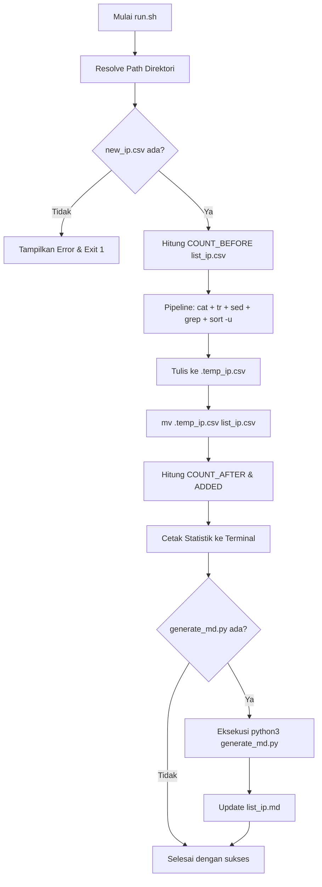

# Blackened - IP Management & Threat Intelligence Utility

Blackened adalah utilitas otomatisasi berbasis Bash dan Python untuk mengelola, menyortir, membersihkan (sanitasi), mendeduplikasi, serta memperkaya daftar IP address (blacklist/threat feed) dengan data geografis, ISP, dan skor reputasi ancaman AbuseIPDB.

---

## Fitur Utama `run.sh`

Script `run.sh` bertindak sebagai *entrypoint* utama dan pipeline pemrosesan data dengan fitur-fitur berikut:

1. **Resolusi Jalur Dinamis (*Dynamic Path Resolution*)**:
   - Menentukan lokasi direktori kerja berdasarkan lokasi fisik file `run.sh`, sehingga script dapat dieksekusi dari direktori mana pun tanpa bergantung pada `pwd` terminal saat ini.

2. **Verifikasi dan Inisialisasi Otomatis**:
   - Memeriksa keberadaan `list_ip.csv`. Jika file belum ada, script akan otomatis membuatnya (`touch`).
   - Memvalidasi keberadaan file input `new_ip.csv` dan menghentikan proses secara aman jika file tidak ditemukan.

3. **Pipeline Sanitasi Data Multi-Tahap**:
   - **Pembersihan Line Ending Windows**: Mengeliminasi karakter *Carriage Return* (`\r`).
   - **Trim Whitespace**: Menghapus spasi di awal dan akhir baris (*leading and trailing spaces*).
   - **Penyaringan Baris Kosong**: Membuang baris kosong atau baris yang hanya berisi whitespace.

4. **Pengurutan dan Deduplikasi Numerik per Oktet (*Octet-based Sorting & Deduplication*)**:
   - Mengurutkan IPv4 secara presisi berdasarkan nilai numerik di setiap oktet (misal: `10.0.0.2` mendahului `10.0.0.10`).
   - Mengeliminasi IP yang duplikat dalam satu lintasan (*single-pass unique extraction*).

5. **Pembaruan Atomik (*Atomic File Update*)**:
   - Menulis hasil pemrosesan ke file temporer (`.temp_ip.csv`) sebelum menimpa file target `list_ip.csv` menggunakan operasi `mv` (atomik). Hal ini mencegah kerusakan data jika proses terhenti di tengah jalan.

6. **Integrasi Generator Intelijen IP (`generate_md.py`)**:
   - Secara otomatis memanggil script Python untuk memperkaya daftar IP dengan data ASN, ISP, Kota, Provinsi, Negara, dan skor AbuseIPDB, lalu menyusunnya ke dalam file `list_ip.md`.

7. **Pelaporan Metrik Eksekusi**:
   - Menghitung dan menampilkan jumlah IP sebelum proses, jumlah IP unik baru yang berhasil ditambahkan, dan total akumulasi IP unik saat ini.

---

## Rincian Teknis `run.sh`

### 1. Struktur File Proyek

```text
blackened/
|-- list_ip.csv        # Database utama daftar IP unik dan terurut
|-- list_ip.md         # Laporan intelijen IP (tabel & statistik)
|-- new_ip.csv         # File input untuk memasukkan daftar IP baru
|-- run.sh             # Entrypoint bash script utama
|-- generate_md.py     # Engine pengayaan metadata & AbuseIPDB
|-- .env.example       # Template konfigurasi API Key
|-- .env               # File environment API Key (opsional)
|-- .ip_cache.json     # Cache lokal respons API (otomatis dibuat)
|-- LICENSE            # Lisensi proyek
`-- README.md          # Dokumentasi teknis
```

### 2. Bedah Pipeline Pemrosesan Data

Perintah inti pada `run.sh`:

```bash
cat "$LIST_IP" "$NEW_IP" 2>/dev/null \
    | tr -d '\r' \
    | sed 's/^[[:space:]]*//;s/[[:space:]]*$//' \
    | grep -v '^$' \
    | sort -n -t . -k 1,1 -k 2,2 -k 3,3 -k 4,4 -u > "$TEMP_FILE"
```

Penjelasan tahapan:
- `cat "$LIST_IP" "$NEW_IP"`: Menggabungkan isi database lama dan input baru ke dalam satu stream output.
- `tr -d '\r'`: Menghapus karakter CRLF format Windows (`\r`), memastikan kompatibilitas antar OS.
- `sed 's/^[[:space:]]*//;s/[[:space:]]*$//'`: Menghapus spasi/tab sebelum dan sesudah string IP.
- `grep -v '^$'`: Membuang seluruh baris kosong.
- `sort -n -t . -k 1,1 -k 2,2 -k 3,3 -k 4,4 -u`:
  - `-n`: Mengaktifkan mode pengurutan numerik.
  - `-t .`: Menentukan karakter titik (`.`) sebagai pembatas antar oktet/field.
  - `-k 1,1 -k 2,2 -k 3,3 -k 4,4`: Mengurutkan perbandingan mulai dari oktet 1, lalu oktet 2, oktet 3, dan oktet 4.
  - `-u`: Menghilangkan duplikasi entri (hanya mengambil entri unik).
- `> "$TEMP_FILE"`: Menyimpan hasil akhir ke file sementara sebelum dilakukan `mv "$TEMP_FILE" "$LIST_IP"`.

### 3. Diagram Alur Kerja



---

## Cara Penggunaan

### 1. Konfigurasi API AbuseIPDB (Opsional)
Jika ingin menampilkan skor bahaya AbuseIPDB pada `list_ip.md`:
1. Salin `.env.example` menjadi `.env`:
   ```bash
   cp .env.example .env
   ```
2. Isi `ABUSEIPDB_API_KEY` di dalam file `.env`:
   ```env
   ABUSEIPDB_API_KEY=api_key_anda_disini
   ```

### 2. Memasukkan IP Baru
Masukkan daftar IP yang ingin ditambahkan ke dalam file `new_ip.csv` (setiap IP dipisahkan baris baru):
```text
103.14.111.239
34.126.128.161
20.210.166.54
```

### 3. Menjalankan Script
Berikan izin eksekusi jika diperlukan:
```bash
chmod +x run.sh
```

Jalankan script:
```bash
./run.sh
```
atau
```bash
bash run.sh
```

### 4. Contoh Output Eksekusi Terminal
```text
==========================================
         PROSES PENYORTIRAN IP            
==========================================
Jumlah IP sebelumnya            : 57
Jumlah IP baru yang ditambahkan : 2
Total IP unik sekarang          : 59
------------------------------------------
Memperbarui list_ip.md...
Mengambil data AbuseIPDB untuk 2 IP...
Berhasil memperbarui /Users/hard13/labs/blackened/list_ip.md (Total: 59 IP)
==========================================
Proses selesai dengan sukses!
```
